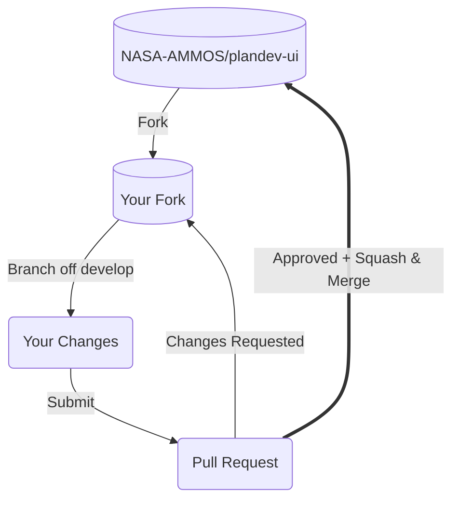

# Contributing to PlanDev UI

Thanks for taking the time to consider contributing! We very much appreciate your time and effort. This document outlines the ways you can contribute to PlanDev UI and the conventions we follow.

- [Prerequisites](#prerequisites)
- [Communication Channels](#communication-channels)
- [Our Development Process](#our-development-process)
- [Submitting a Pull Request](#submitting-a-pull-request)
- [Coding Rules](#coding-rules)
- [Commit Message Guidelines](#commit-message-guidelines)
- [Ways to Contribute](#ways-to-contribute)

## Prerequisites

### License

Our project's licensing terms are documented in [LICENSE](LICENSE). Please review it before contributing — it impacts how your contributions may be redistributed.

### Code of Conduct

We follow the [Contributor Covenant](CODE_OF_CONDUCT.md). By participating, you agree to its terms.

### Developer Environment

For details on running, building, and testing PlanDev UI locally, see:

- [README.md](README.md) — quick start and project overview
- [docs/DEVELOPER.md](docs/DEVELOPER.md) — local development setup
- [docs/ENVIRONMENT.md](docs/ENVIRONMENT.md) — environment variables
- [docs/TESTING.md](docs/TESTING.md) — running unit and end-to-end tests

At a minimum you'll need:

1. A GitHub account
2. Git installed locally
3. Node.js (see `.nvmrc`) and npm
4. The ability to build and test the project on your local machine

## Communication Channels

Before contributing, it's a good idea to socialize your idea early. Our channels are:

- [Issue tracker](https://github.com/NASA-AMMOS/plandev-ui/issues) — report issues or propose changes
- [Discussions](https://github.com/NASA-AMMOS/plandev-ui/discussions) — design conversations and show-and-tell
- [Slack channel][slack] — real-time chat

## Our Development Process



We integrate changes through pull requests against the `develop` branch. Forking is preferred over direct branching for external contributors; core team members typically branch directly.

### Find or File an Issue

Make sure people know what you're working on. Check [the issue tracker][github-issues] for a related issue, or file a new one to start the conversation.

### Choose the Right Branch

`develop` is the default branch and the integration target for all new work. Branch off `develop`.

## Submitting a Pull Request

1. Search [GitHub][github-pulls] for an open or closed PR that relates to your submission to avoid duplicating effort.
2. Confirm an issue describes the problem or feature. Discussing the design up front helps ensure the work will be accepted.
3. Clone the [NASA-AMMOS/plandev-ui repo][github] (or your fork).
4. Create a branch off `develop`:

   ```shell
   git checkout develop
   git pull origin develop
   git checkout -b my-fix-branch develop
   ```

5. Make your changes.
6. Follow our [Coding Rules](#coding-rules).
7. Commit using our [Commit Message Guidelines](#commit-message-guidelines). Adherence is necessary because release notes are auto-generated from these messages.

   ```shell
   git commit -a
   ```

   The optional `-a` flag will automatically `add` and `rm` edited files.

8. Push your branch:

   ```shell
   git push origin my-fix-branch
   ```

9. Open a pull request against `plandev-ui:develop`.

### Responding to Review

If reviewers request changes:

- Make the updates and follow the [Coding Rules](#coding-rules).
- [Rebase][rebase] and force-push to update the PR:

  ```shell
  git rebase develop -i
  git push -f
  ```

If your branch falls behind `develop`:

- Rebase locally as above, **or**
- Use the GitHub UI's "Update branch" dropdown → "Update with rebase".

### Merging

Once approved, prefer **Squash and merge** to keep `develop` history clean. Update the squash commit message body to include only what's relevant. Do **not** modify the PR title at squash time — that breaks our release-notes tracking.

After merge:

```shell
git push origin --delete my-fix-branch   # delete remote branch
git checkout develop                      # back to develop
git pull origin develop                   # pull the merged change
git branch -D my-fix-branch              # delete local branch
```

## Coding Rules

Before opening a PR, run:

1. `npm run format:write`
2. `npm run lint`
3. `npm run lint:css`
4. `npm run check`
5. Follow the testing procedures in [docs/TESTING.md](docs/TESTING.md)

## Commit Message Guidelines

We have precise rules for commit messages. They produce more readable history and drive auto-generated release notes.

### Format

```
<type>: <subject>
<BLANK LINE>
<body>
```

The **header** is mandatory. No line of the commit message may be longer than 100 characters — this keeps messages readable on GitHub and in git tools.

Samples:

```
docs: update readme
```

```
fix: need to depend on latest rxjs and zone.js

The version in our package.json gets copied to the one we publish, and users need the latest of these.
```

([more samples](https://github.com/NASA-AMMOS/plandev-ui/commits/develop))

### Revert

If the commit reverts a previous commit, prefix the header with `revert:` followed by the reverted commit's header. The body should say `This reverts commit <hash>.`

### Type

Must be one of:

- **build**: Changes that affect the build system or external dependencies
- **ci**: Changes to our CI configuration files and scripts
- **docs**: Documentation only changes
- **feat**: A new feature
- **fix**: A bug fix
- **perf**: A code change that improves performance
- **refactor**: A code change that neither fixes a bug nor adds a feature
- **release**: A release commit
- **style**: Changes that do not affect code meaning (whitespace, formatting, missing semicolons, etc.)
- **test**: Adding missing tests or correcting existing tests

### Subject

- Use the imperative, present tense: "change" not "changed" nor "changes"
- Don't capitalize the first letter
- No period at the end

### Body

Use the imperative, present tense, like the subject. The body should explain motivation and contrast with previous behavior.

**Breaking Changes** should start with the word `BREAKING CHANGE:` followed by a space or two newlines. The remainder describes the breaking change.

## Ways to Contribute

### Code

Before writing code, check the [issue tracker][github-issues]:

1. Look for duplicate issues covering your idea — comment there with your thoughts.
2. If none exist, file a new issue and start a conversation before opening a PR.

When ready to contribute code:

1. Make sure development [prerequisites](#prerequisites) are met.
2. Follow our [development process](#our-development-process).
3. Open a PR per [Submitting a Pull Request](#submitting-a-pull-request).

### Documentation

Documentation lives in:

- Top-level: [README.md](README.md), [CODE_OF_CONDUCT.md](CODE_OF_CONDUCT.md), [CONTRIBUTING.md](CONTRIBUTING.md)
- [docs/](docs/) — developer docs (deployment, environment, release, testing, developer setup)
- [PlanDev documentation site](https://nasa-ammos.github.io/plandev-docs/) — user-facing docs

Documentation contributions follow the same [development process](#our-development-process) as code contributions.

### Security Vulnerabilities

Please **do not** file security vulnerabilities to the public issue tracker. Report them privately to [plandev_support@jpl.nasa.gov](mailto:plandev_support@jpl.nasa.gov).

When reporting, please include:

- Severity assessment
- Any known workarounds
- Return contact information for follow-up

[github]: https://github.com/NASA-AMMOS/plandev-ui
[github-issues]: https://github.com/NASA-AMMOS/plandev-ui/issues
[github-pulls]: https://github.com/NASA-AMMOS/plandev-ui/pulls
[rebase]: https://dev.to/maxwell_dev/the-git-rebase-introduction-i-wish-id-had
[slack]: https://app.slack.com/client/T024LMMEZ/C0163E42UBF
